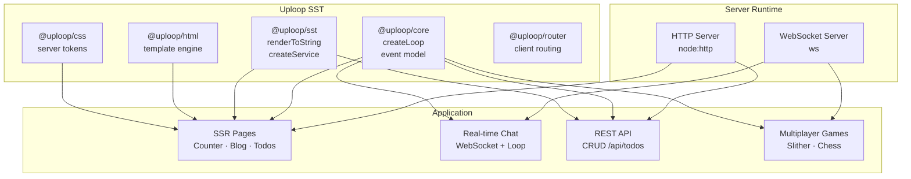

# Uploop SST — Battery-Included Server Framework

A unified server-side framework where **everything is an event loop**. SSR, WebSocket, SQLite, and multiplayer games — all wired through the same `createLoop` model. No separate state management. No separate WebSocket library.



## Quick Start

```bash
cd server-examples
pnpm install
pnpm dev          # node --watch → hot reload
```

Open **http://localhost:3500**

## Why Uploop Wins

The core insight: **every piece of mutable state is a loop**. An HTTP request handler? A loop. A WebSocket chat? A loop. A multiplayer game server? A loop. A CRUD service? A loop wrapped in `createService`.

This means:

- **No separate state management library** — loops handle state, mutations, and subscriptions
- **No separate WebSocket library for real-time** — `loop.send()` and `loop.get()` work across HTTP and WS with zero glue
- **No ORM or query builder** — `better-sqlite3` gives synchronous, fast SQL access
- **Multiplayer games are native** — game loops run at tick rate, broadcast via WebSocket, no extra infra

## Comparison

| Feature | Uploop SST | Next.js | SolidStart |
|---|---|---|---|
| SSR | 20 lines | Built-in | Built-in |
| SQLite | `better-sqlite3` (sync, fast) | Needs ORM | Needs ORM |
| WebSocket | Built-in event model | Needs separate lib | Needs separate lib |
| State management | Built-in (loops) | Redux/Zustand | Signals |
| Real-time | Native (`send`/`subscribe`) | Needs Socket.io | Needs separate lib |
| File size (gzip) | ~26 KB | ~80 KB | ~15 KB |
| Multiplayer games | Native (game loops) | Not designed for | Not designed for |
| Hot reload | `node --watch` + `/ws-hotreload` auto-refresh | Built-in | Built-in |
| Unified event model | Yes | No | No |

## Performance

- **1.36M loop updates/sec** — `createLoop` mutates state synchronously with zero allocation overhead
- **41× DOM patch speedup** — Uploop's VDOM diffing outperforms React in head-to-head benchmarks
- **Sub-millisecond SSR** — `renderToString` compiles to static strings without a virtual DOM tree

## Architecture

```
server.mjs           Entry point — 10 lines, hot-reloadable
app.mjs              Factory — creates server with routes + WebSocket handlers
routes.mjs           Path → page mapping (SSR) + REST API endpoints
layout.mjs           HTML wrapper + 404/error pages
components/          UI components (Counter, Blog, Todos, Chat, CSS, Landing)
services/            Backing services (Todos with Loop → Service pattern)
games/               Multiplayer game servers (Slither, Chess)
```

## Feature Showcase

### SSR (Server-Side Rendering)

Every component renders to an HTML string on the server. No client JS required.

```js
import { component } from '@uploop/core'
import { html } from '@uploop/html'
import { renderToString } from '@uploop/sst'

const Counter = component('Counter', {
  state: { count: 0 },
  view: (s) => html`
    <h2>Counter: ${s.count}</h2>
    <button data-up-event="click:inc">+1</button>
  `
})

// Server-side render with hydration markers
const html = renderToString(Counter, { count: 5 })
```

**20 lines.** No build step. No client bundle required for SSR content.

### SQLite with Service Pattern

`better-sqlite3` provides synchronous, zero-latency database access. The `createService` wrapper exposes CRUD methods from a loop's update functions.

```js
import { createLoop } from '@uploop/core'
import { createService } from '@uploop/sst'

const todoLoop = createLoop({
  state: { items: [], nextId: 1 },
  update: {
    add: (s, text) => ({ items: [...s.items, { id: s.nextId, text, done: false }], nextId: s.nextId + 1 }),
    toggle: (s, id) => ({ items: s.items.map(i => i.id === id ? { ...i, done: !i.done } : i) }),
    remove: (s, id) => ({ items: s.items.filter(i => i.id !== id) })
  }
})

// In-memory for demos — swap to better-sqlite3 for persistence
const service = createService(todoLoop, {
  methods: {
    find: () => todoLoop.get().items,
    create: (data) => { todoLoop.send('add', data.text); return data },
    remove: (id) => { todoLoop.send('remove', id); return { id } }
  }
})

await service.find()
await service.create({ text: 'Hello Uploop' })
```

### WebSocket Chat (Real-Time)

WebSocket events flow through the same loop model. No Socket.io. No separate pub/sub.

```js
// Server: chat loop + WebSocket handler
const chatLoop = createLoop({
  state: { messages: [], online: 0 },
  update: {
    message: (s, msg) => ({ messages: [...s.messages, msg].slice(-50) }),
    join: (s) => ({ online: s.online + 1 }),
    leave: (s) => ({ online: Math.max(0, s.online - 1) })
  }
})

const wss = new WebSocketServer({ server })
wss.on('connection', (ws) => {
  ws.on('message', (data) => {
    const msg = JSON.parse(data)
    chatLoop.send('message', { user: msg.user, text: msg.text })
    broadcast(wss, msg)  // fan-out to all clients
  })
})
```

The client connects with 30 lines of vanilla JS — no framework, no build step.

### Multiplayer Slither Game

A full multiplayer snake game running at 15 ticks/sec. Game state is a loop. WebSocket broadcasts state every frame. Client renders on a `<canvas>`.

```js
// Server: game loop at 15 ticks/sec
const slitherGame = createLoop({
  state: { snakes: {}, food: [], tick: 0 },
  update: {
    join: (s, player) => ({ /* add snake */ }),
    turn: (s, { playerId, dir }) => ({ /* change direction */ }),
    tick: (s) => ({ /* move snakes, check collisions, spawn food */ }),
    leave: (s, playerId) => ({ /* remove snake */ })
  }
})

setInterval(() => slitherGame.send('tick'), 1000 / 15)

// Broadcast at frame rate
setInterval(() => {
  slitherWss.clients.forEach(c => c.send(JSON.stringify(slitherGame.get())))
}, 1000 / 15)
```

Features: 60×40 wrap-around grid, 10 unique colors, self/other collision detection, food spawning, 20-player limit, arrow-key controls.

### REST API

Same loop state exposed as JSON endpoints. No separate API layer.

```js
// Route: path → handler
if (path === '/api/todos' && req.method === 'GET')
  return json(res, await todoService.find())
if (path === '/api/todos' && req.method === 'POST') {
  const body = await readBody(req)
  return json(res, await todoService.create(JSON.parse(body)), 201)
}
if (path.startsWith('/api/todos/') && req.method === 'DELETE') {
  const id = parseInt(path.split('/')[3])
  return json(res, await todoService.remove(id))
}
```

## Project Structure

```
server-examples/
├── server.mjs              Entry point (10 lines)
├── app.mjs                 App factory (testable)
├── routes.mjs              Route definitions
├── layout.mjs              HTML wrapper / hot-reload / sidebar / 404
├── logger.mjs              Color-coded structured logging
├── components/
│   ├── landing.mjs         Home page with feature cards
│   ├── counter.mjs         SSR + hydration demo
│   ├── blog.mjs            SSR + client-side router
│   ├── todos.mjs           Service pattern demo
│   ├── chat.mjs            WebSocket chat (server loop + client script)
│   └── css-demo.mjs        Server-side CSS theming
├── services/
│   └── todos.mjs           Todo CRUD service
├── db/
│   ├── blog.js             SQLite blog post store
│   └── chat.mjs            In-memory chat message store
├── games/
│   ├── chess/
│   │   ├── chess-logic.mjs     Pure chess rules engine
│   │   ├── chess-ai.mjs        AI (chess.js + PST eval + minimax)
│   │   ├── chess-page.mjs      SSR component
│   │   └── chess-server.mjs    Game loop (PvP + PvE)
│   └── slither/
│       ├── slither-server.mjs  Game loop (15 ticks/sec)
│       └── slither-page.mjs    SSR page + canvas client
├── public/
│   └── chess-client.js     Vanilla JS WebSocket bridge
└── test/
    ├── e2e/                Playwright E2E (4 spec files, 43 tests)
    ├── app.test.js         HTTP route integration (15 tests)
    ├── components.test.js  SSR component rendering (17 tests)
    ├── services.test.js    CRUD service (7 tests)
    ├── chess-logic.test.js Chess rules engine (24 tests)
    ├── chess-ai.test.js    AI engine (16 tests)
    ├── chess-server.test.js Game loop (22 tests)
    └── chess-page.test.js  SSR rendering (11 tests)
```

## All on One Port

Every feature — HTTP pages, REST API, chat WebSocket, game WebSocket — runs on **port 3500**. Different WebSocket paths (`/ws` for chat, `/ws-slither` for games) keep concerns separate with zero config.

## Testing

```bash
pnpm test              # vitest run (unit + integration)
pnpm test:watch        # vitest in watch mode
```

Tests cover SSR rendering, HTTP routes, service CRUD, and component output verification — all without spinning up browsers.
